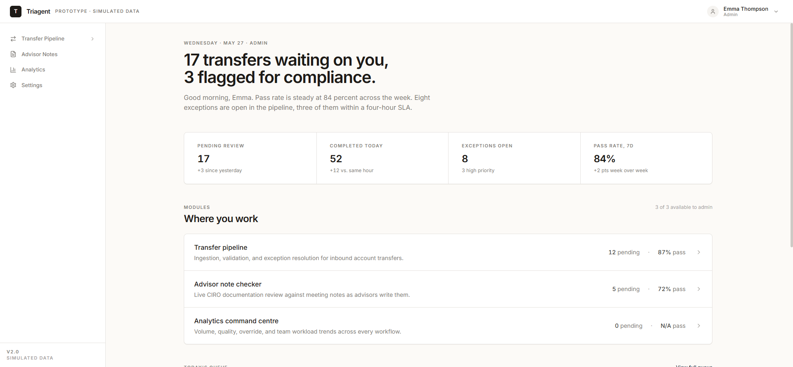
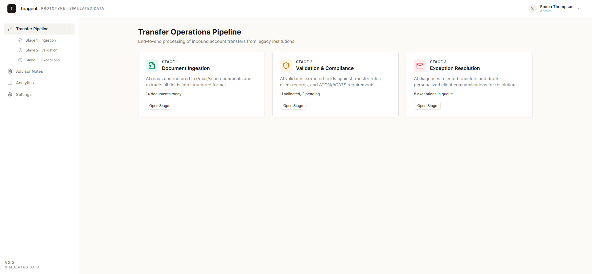
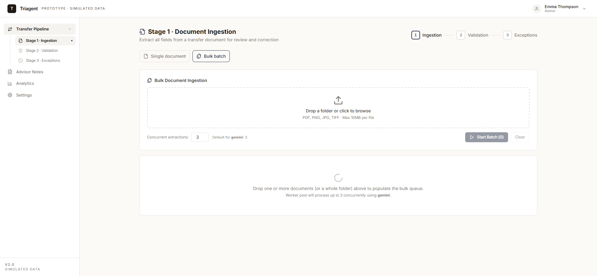
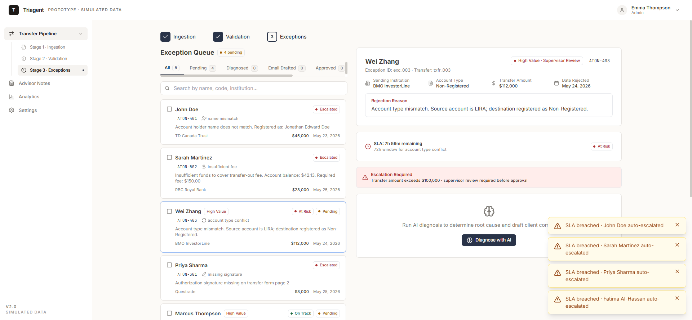
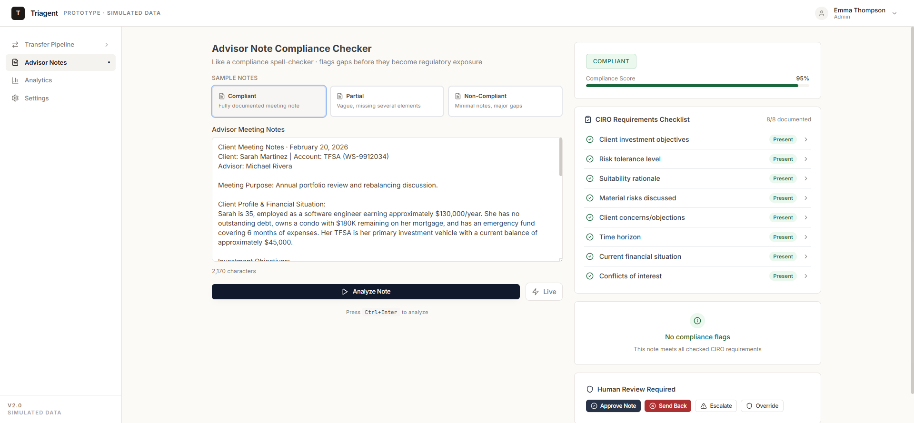
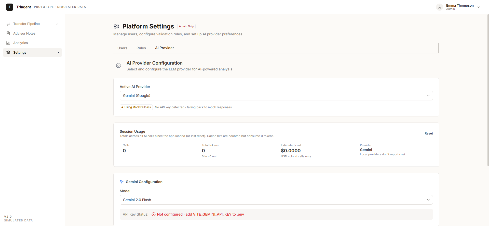
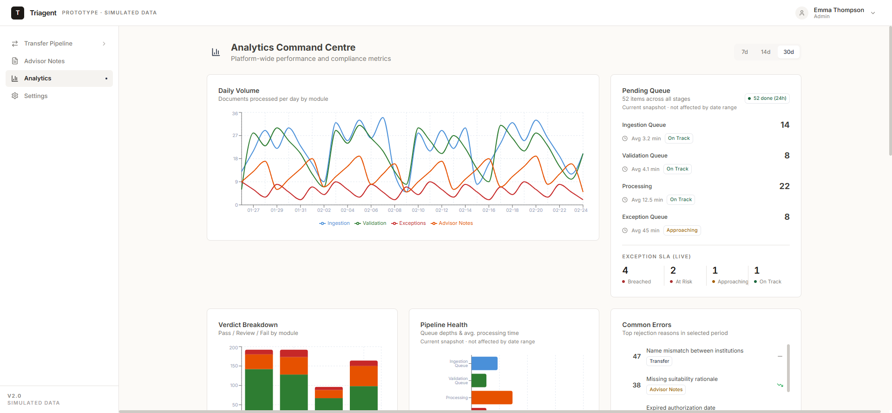

# Triagent — AI Triage for Document Operations

> **AI triages, humans approve.**

[](https://github.com/TrishulMallur/Triagent/actions/workflows/ci.yml)

**🔗 Live demo — [triagent-six.vercel.app](https://triagent-six.vercel.app)** · runs zero-config on a mock LLM provider, no signup or API key required.

An AI triage agent that extracts, validates, and routes regulated financial documents through SLA-driven workflows with human-in-the-loop review. Built as a portfolio project demonstrating multi-provider LLM orchestration, schema-validated AI responses, real-time SLA tracking, and a worker-pool batch pipeline.



**Status:** prototype / demo. Ships with a mock LLM provider so the full feature set works zero-config — no API key required.

---

## Tech stack

| Layer | Choice | Notes |
|---|---|---|
| UI | React 18.3 + TypeScript 5.6 (strict) + Vite 6 + Tailwind 3 | Functional components, hooks, strict null checks |
| Routing | React Router 6 | Per-role route guards |
| Icons / Charts | Lucide React, Recharts | |
| LLM providers | Anthropic Claude, Google Gemini, LM Studio, llama.cpp, Mock | Auto-fallback to mock when no API key is detected |
| Response validation | Zod schemas with auto-retry + Retry-After respect | Bad JSON retries once; provider-level 429/5xx retries with exponential backoff + jitter |
| Streaming | Browser-side SSE for the 4 real providers; mock chunks its responses | Discriminated-union event protocol (`{type:'text'}` / `{type:'usage'}`) |
| Caching | SHA-256 keyed in-memory cache shared across streaming + non-streaming paths | Optional `localStorage` persistence |
| Backend (optional) | Python FastAPI + SQLite | Audit log, document text extraction (PyMuPDF + OCR fallback). The frontend works without it. |
| Tests | Vitest + Testing Library (129 unit/component tests) + Playwright (5 E2E) | `npm test` and `npx playwright test` |
| Pre-commit | husky + lint-staged | Runs `tsc -b --noEmit` on staged TS files |

---

## What's in the demo

### Transfer pipeline — Stages 1 → 2 → 3

Ingestion ▸ Validation ▸ Exception resolution. Each stage runs an LLM call, validates against a Zod schema, and surfaces a human review panel (approve / reject / escalate / override).



#### Stage 1 — Ingestion (single + bulk modes)

Single-document mode (paste / upload PDF / pick sample), or bulk mode that runs a worker-pool over a folder of documents with configurable concurrency.



The bulk queue uses a semaphore-capped `WorkerPool<T,R>` ([src/lib/worker-pool.ts](src/lib/worker-pool.ts)) that yields per-item results as they complete, supports abort-drain, and respects external `AbortSignal`. Concurrency defaults to 3 for cloud providers and 1 for local providers.

#### Stage 3 — Exception resolution with live SLA tracking

Per-card SLA badges (`On Track` / `Approaching` / `At Risk` / `Breached`), live countdowns on the detail panel, and a 60-second ticker that auto-escalates exceptions when their SLA window expires.



SLA windows are per-rejection-type and editable in Settings → Rules. Auto-escalation has a kill switch and writes an audit-log entry with the breach metadata.

### Advisor Notes — CIRO compliance checker

Paste an advisor meeting note; the LLM scores it against the 8 CIRO requirements, flags compliance gaps with severity + suggestion, and the panel auto-escalates verdicts below 50% or non-compliant.



Advisor Notes opts into the streaming response path — the result panel shows tokens as they arrive instead of a spinner.

### Settings — multi-provider config + session usage

Switch providers live, configure per-rejection-type SLA windows, see token + cost totals across the whole session.



### Analytics Command Centre

Volume, verdict mix, pipeline health, common errors, and live SLA breakdown across the pending queue.



---

## Quick start

The mock provider lets the entire app work without any API keys.

```bash
npm install
npm run dev
# open http://localhost:5173 (or the port Vite picks)
```

### Optional — point at a real LLM

```bash
cp .env.example .env
# add ONE of:
#   VITE_ANTHROPIC_API_KEY=...
#   VITE_GEMINI_API_KEY=...
#   VITE_LMSTUDIO_URL=http://localhost:1234   (or any OpenAI-compatible local server)
#   VITE_LLAMACPP_URL=http://localhost:8080
# then:
npm run dev
```

The active provider can also be swapped at runtime in **Settings → AI Provider** without restarting the dev server. If no provider is configured the UI shows a `Using Mock Fallback` badge and routes calls through the deterministic mock.

### Optional — start the FastAPI backend

The backend adds real PDF text extraction, OCR fallback for scans, and a persistent SQLite audit log. The frontend auto-falls-back when it's offline.

```bash
cd backend
pip install -r requirements.txt
python main.py   # runs on http://localhost:8000
```

Then set `VITE_USE_BACKEND=true` in `.env` to route AI calls through the backend instead of calling providers directly from the browser.

### Environment

| Variable | Default | Purpose |
|---|---|---|
| `VITE_ANTHROPIC_API_KEY` | unset | Claude provider |
| `VITE_GEMINI_API_KEY` | unset | Gemini provider |
| `VITE_LMSTUDIO_URL` | `http://localhost:1234` | OpenAI-compatible local server |
| `VITE_LLAMACPP_URL` | `http://localhost:8080` | `llama.cpp` server |
| `VITE_DEFAULT_PROVIDER` | `mock` | `claude` / `gemini` / `lmstudio` / `llamacpp` / `mock` |
| `VITE_USE_BACKEND` | `false` | Route AI calls through FastAPI |
| `VITE_API_BASE_URL` | `http://localhost:8000` | Backend URL when `VITE_USE_BACKEND=true` |

---

## Deploy

See [docs/deploy.md](docs/deploy.md) for the full Vercel (frontend) + Railway (backend) walkthrough. The mock provider lets the Vercel deploy work zero-config; Railway only matters if you want the real FastAPI backend live.

---

## Tests

```bash
npm test              # vitest run — 129 tests, ~28s
npm run test:watch    # vitest in watch mode
npx playwright test   # 5 E2E tests, ~31s
```

| Suite | Count | Coverage |
|---|---|---|
| Vitest unit + component | 129 across 14 files | Providers, retry, cache, schemas, SLA helpers, worker-pool, contexts, RulesContext preamble rendering |
| Playwright E2E | 5 | Happy path (ingestion → validation), bulk-ingestion three-file batch + confirm-all, regression fixes, settings llama.cpp graceful failure |

---

## Architecture highlights

- **Provider interface** ([src/lib/llm-provider.ts](src/lib/llm-provider.ts)) — every provider implements `analyze()` returning `{content, usage}` and an optional `analyzeStream()` yielding a `StreamEvent` discriminated union. The 4 real providers parse vendor-specific token-usage fields into a shared `TokenUsage` shape.
- **Schema-validated responses** ([src/lib/schemas.ts](src/lib/schemas.ts)) — 4 Zod schemas (`AdvisorNoteAnalysisSchema`, `TransferValidationSchema`, `DocumentExtractionSchema`, `ExceptionDiagnosisSchema`) gate every LLM output before it reaches the UI. Schema failures retry once.
- **Retry policy** ([src/lib/retry.ts](src/lib/retry.ts)) — exponential backoff with 25% jitter, respects `Retry-After`, separate caps for HTTP vs schema retries.
- **Rules context** ([src/contexts/RulesContext.tsx](src/contexts/RulesContext.tsx)) — Settings → Rules toggles are injected into the system prompt preamble at call time, persist to `localStorage`, and survive reloads.
- **Audit log** — backend-backed when available, falls back to in-memory. The Analytics page reads the log directly.
- **Human-in-the-loop** — the LLM never approves, sends emails, or auto-completes. Every output is a recommendation with required human sign-off; overrides require a documented reason.

---

## Reliability & operating notes

The provider layer is designed so real-API failures degrade to user-visible error toasts, not crashes. Every route is wrapped in an `<ErrorBoundary>`, every LLM call goes through `withRetry` + Zod validation, and `Retry-After` is honoured for both 429 and 503 responses.

| Failure | What happens |
|---|---|
| LLM emits non-JSON | One schema retry budget, then surfaces as `AiResponseError` toast |
| Schema drift in LLM output | Same path as above; raw response is preserved for the toast |
| 429 / 503 from provider | Exponential backoff with jitter, up to 4 attempts, respects `Retry-After` |
| Token-limit truncation on long input | Truncated JSON fails Zod validation; surfaces as schema error |
| Network drop mid-stream | SSE iterator throws, retry loop kicks in, falls through to error toast |
| No API key set | Auto-falls-back to mock provider; UI shows a `Using Mock Fallback` badge |

**Smoke test before plugging in a real key** (covers every code path for under $0.05 in Gemini credits): set `VITE_GEMINI_API_KEY`, then walk through (1) Advisor Notes with the "Compliant" sample, (2) the same with **Live** toggled on (tests streaming), (3) Stage 1 Ingestion → "Use Sample" → Extract Fields, (4) Stage 2 Validation on the same sample, (5) Stage 3 Exceptions → "Diagnose with AI" on any item.

> **Security warning.** Any environment variable prefixed `VITE_` is embedded in the JavaScript bundle at build time and visible to every visitor's DevTools. `VITE_*_API_KEY` is fine for local development; for any public deploy, route AI calls through the FastAPI backend (`VITE_USE_BACKEND=true`) and keep keys server-side. The `.env.example` file documents this in line.

---

## Project structure

```
src/
├── components/
│   ├── layout/        AppLayout, Header, Sidebar
│   ├── shared/        DocumentInput, FileUpload, HumanReviewPanel, AiAnalysisContainer, PdfViewer
│   └── ui/            Button, Card, Badge, VerdictBadge, ScoreBar, ConfidenceIndicator, etc.
├── contexts/          LLMContext, RulesContext, RoleContext, ToastContext
├── data/              MOCK_CLIENTS, MOCK_EXCEPTIONS, MOCK_TRANSFER_DOCS, MOCK_ADVISOR_NOTES
├── hooks/             useClaudeAnalysis, useAuditLog, useAuditEntries, useKeyboardShortcuts
├── lib/
│   ├── providers/     claude, gemini, lmstudio, llamacpp, mock, backend
│   ├── ai.ts          runAnalysis pipeline + 4 exported AI functions
│   ├── cache.ts       SHA-256 keyed response cache
│   ├── retry.ts       withRetry + classification
│   ├── schemas.ts     Zod schemas
│   ├── sla.ts         computeSlaStatus / formatSlaCountdown
│   ├── worker-pool.ts WorkerPool<T,R> with abort-drain
│   ├── usage-tracker.ts singleton call/cost tracker
│   └── pricing.ts     MODEL_PRICING + calculateCost
├── pages/
│   ├── advisor-notes/
│   ├── analytics/
│   ├── exceptions/
│   ├── ingestion/     (single + bulk modes)
│   ├── settings/      Users + Rules + AI Provider tabs
│   └── validation/
└── types/

backend/
├── main.py            FastAPI app (audit, /api/health, /api/documents/extract-text)
└── requirements.txt

e2e/                   5 Playwright specs
docs/screenshots/      README assets
```

---

## Roles

Click the user avatar (top right) to switch between roles. Each role gates module visibility:

- **Operations Agent** — Pipeline + Analytics
- **Financial Advisor** — Advisor Notes + Analytics
- **Compliance Officer** — All review modules
- **Manager / Supervisor** — All modules + full analytics
- **Admin** — Everything + Settings

---

## License

[Apache License 2.0](LICENSE) © 2026 Trishul Mallur.

> **Disclaimer:** This is a portfolio demonstration, not a production system. It handles no real client money, PII, or regulatory filings, and nothing here constitutes financial, legal, or compliance advice. Provided "as is", without warranty of any kind.

---

Built as a portfolio project, February 2026.
